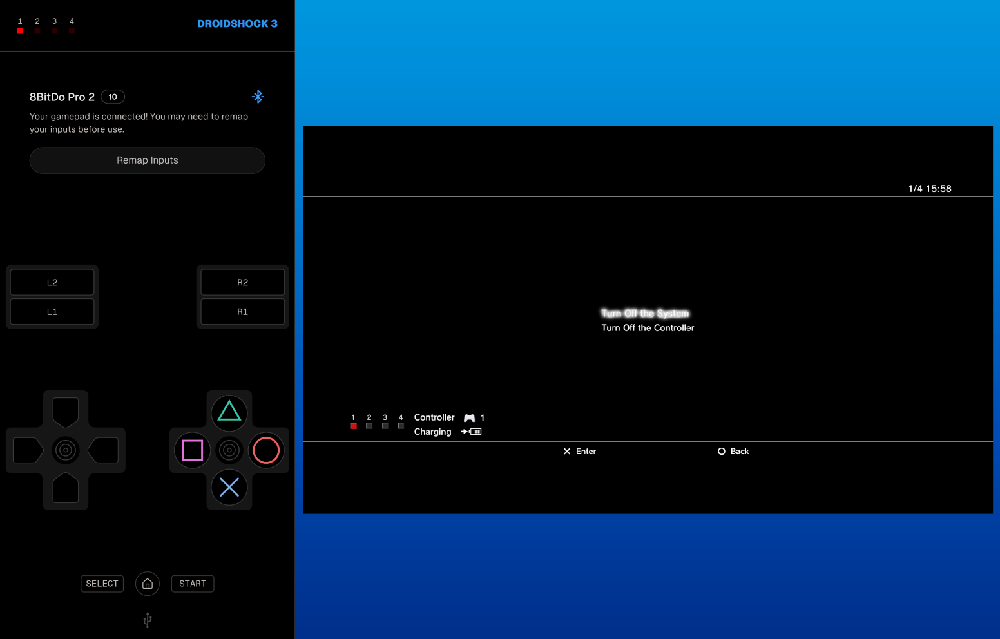

# Droidshock 3

Turn your rooted Android phone into a Sony DualShock 3 controller. Pair a Bluetooth
gamepad to relay its inputs, or use the on-screen controls directly — inputs are
forwarded as authentic DS3 HID reports over USB to a PS3 or PC.
[Download the APK (arm64)](../../releases/latest).

> [!IMPORTANT]
> Root access is required — ConfigFS and FunctionFS are kernel interfaces gated to root, and on
> Android the daemon needs to reclaim the UDC from the system USB stack before the gadget
> can bind.



## How it works

```
Bluetooth gamepad  ──┐
On-screen controls ──┤  droidshock3 (Flutter · Android)
                     │        │
                     │        │  TCP · loopback
                     │        ▼
                     │   bridge (daemon)
                     │        │  FunctionFS / USB Gadget
                     │        ▼
                     │   ffsds3 (Dart library)
                     │        │  usb_gadget (Dart library)
                     │        │  ConfigFS / FunctionFS
                     │        ▼
                     │   Linux USB stack
                     │        │  USB HID
                     │        ▼
                     └──► Host (PS3 / PC)
```

- **[`droidshock3`](droidshock3/README.md)** — Flutter Android app. Provides an
  on-screen DualShock 3 layout, Bluetooth gamepad pass-through with remappable inputs,
  and player LED feedback from the PS3's output reports.
- **[`bridge`](bridge/README.md)** — on-device TCP daemon. Owns the full gadget
  lifecycle: registers the DS3 USB device, binds it to the UDC, and streams HID reports
  in both directions between the app and the USB host.
- **[`ffsds3`](ffsds3/README.md)** — Dart library. Handles the low-level DualShock 3
  USB emulation over FunctionFS, including input/output reports and EEPROM.

## Dev-board usage

If you have a dev-board with a UDC port you can use the `ffsds3` CLI directly.
Most boards require external power — the PS3 only supplies 100 mA before enumeration completes
(per the USB spec), which may not be enough to boot.

```bash
dart compile exe bin/ffsds3.dart --target-os=linux --target-arch=arm64 -o ffsds3
sudo ./ffsds3
```

## Contributing

Contributions are welcome! Please fork the repository and submit a pull request.
Follow the existing code style.
